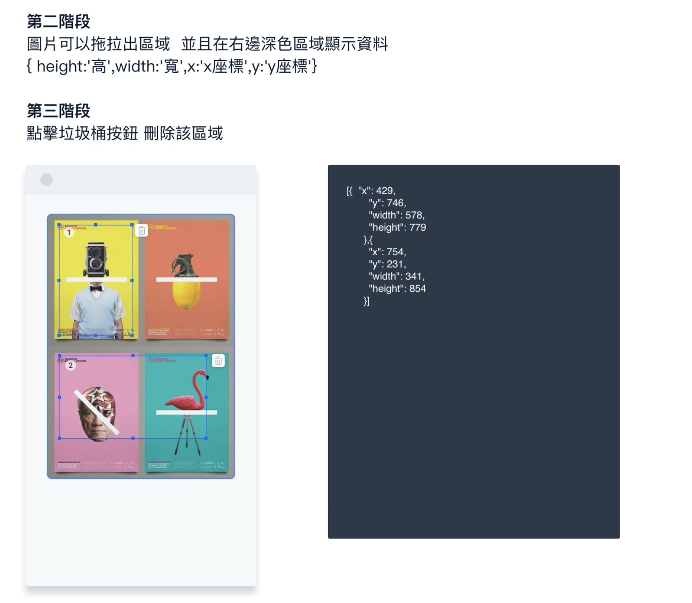

# Image Map Editor

## Instructions

This repository contains simple project initialized with [Create React App](https://create-react-app.dev/). Please use this as the foundation for developing an application that meets the design specifications and technical expectations below. The whole process should take no more than 3 to 6 hours.

### Design Specifications

Figure 1:

Figure 2:

1. Implement a single-page React application that allows the user to upload an image of unlimited size from their local machine.
2. The uploaded picture should be displayed in the interactive image preview pane on the left side of the screen (see figure 2). The picture should be scaled to a width of 355 px, and the height should be constrained by the original aspect ratio of the picture.
3. The user should be able to select any number of rectangular areas in the image preview pane, and the coordinates of the selected area relative to the size of the image itself will be displayed in a readable, indented format in the data preview pane (figure 2, right).
4. The user should be able to delete each selection block using an icon similar to what is displayed in the sample image.
5. The user should be able to arbitrarily reposition and resize each selection block without exceeding the dimensions of the image preview.
6. The data preview panel should be updated with selection block coordinates after every addition, deletion, resize, or reposition action.
7. Optional bonus: ensure each selection block cannot overlay another selection block.

Note: emulating the look and feel of the sample images is encouraged but the more important part is completing the functionality described above.

## Technical Expectations

- Use TypeScript, React hooks, and functional components to develop the application.
- CRA should not emit any linting or type errors when the application is complete, but you can disable errors where appropriate.
- Using third party packages installed with `yarn` is welcome; you don’t need to (and probably shouldn’t) write everything from scratch, but we may be interested in why you chose a particular approach.
- For CSS-in-JS we suggest (but do not require) using [Styled Components](https://styled-components.com/).
- Clean and readable code style is encouraged!

## Git Flow

- Please fork the `develop` branch to work on the application, and later open a pull request to `develop` branch using the template provided when it is ready for review.
- Use [Conventional Commits](https://www.conventionalcommits.org/en/v1.0.0/) style to name your branch, commits, and pull request.
- Team members may leave some comments on your PR as code review; feel welcome to respond and interact there, or send a private message if you prefer.

If you have any questions about the assignment or the process, you are welcome to send an email and ask! Thank you for taking the time to complete this assignment. Good luck!
