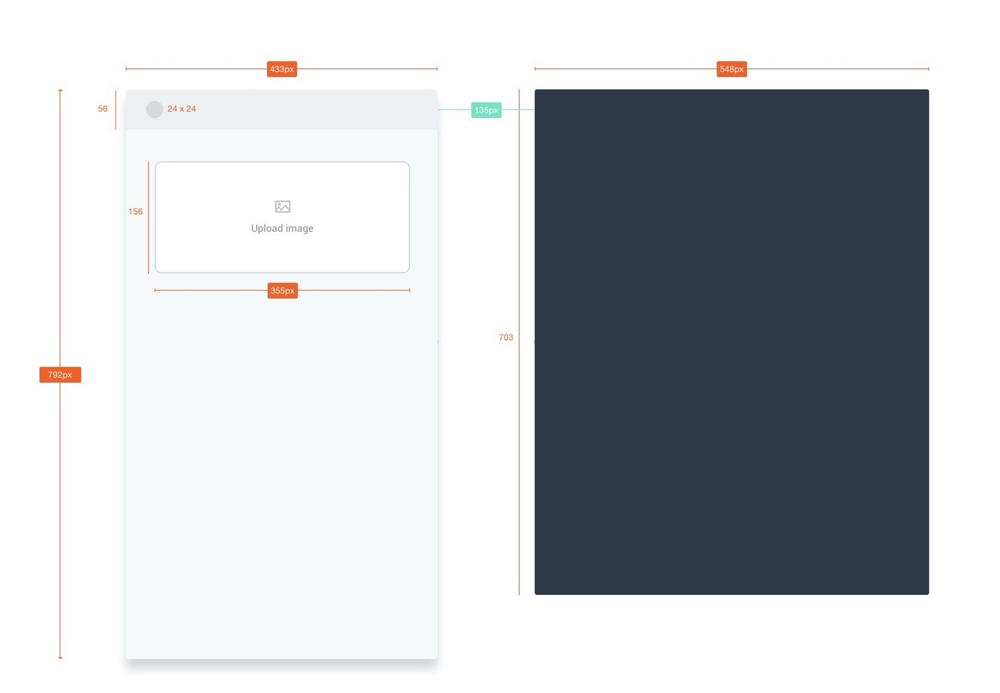
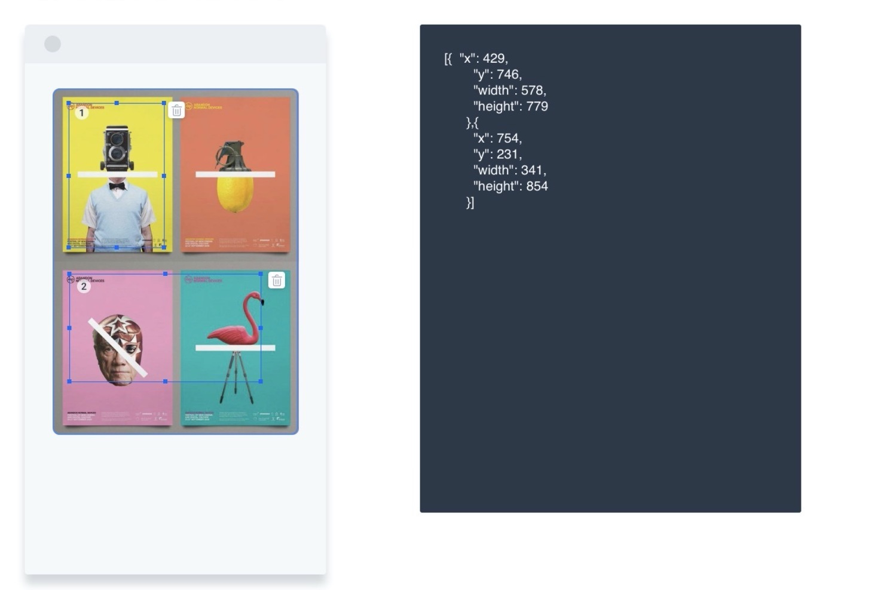

# Image Map Editor

## 說明

這個前端作業是使用 `Create React App` 建立，請依照說明要求完成指定功能與畫面

## 說明

### 圖示
圖一

圖二

### 說明文字
1. 用 React.js 實現一個 SPA，該 SPA 可以讓使用者從本地選擇一張不限尺寸的圖片顯示於畫面上
2. 選擇的圖片會顯示於畫面左側預覽中（如圖二左），圖片縮放到寬 355px，高則根據寬度換算的比例來換算高度
3. 使用者可以在圖片預覽區塊內選取任意數量的矩形區域，選取到的區域座標會映射回圖片本身的尺寸顯示於畫面右側區塊，顯示的方式要有基本的縮排（如圖二右）
4. 使用者可以刪除矩形選取區塊，刪除後右側對應的座標資料需要一併消失

## 基本要求
- 請 fork `develop` branch，完成之後請開 PR 到 `develop` branch 提交此作業
- 請使用 TypeScript 開發
- 請使用 `React hooks` 來實作
- 如果必要的話，可以使用第三方套件（請使用 yarn 安裝）
- 顯示樣式盡量貼近說明圖示樣式，但以功能完成度為優先