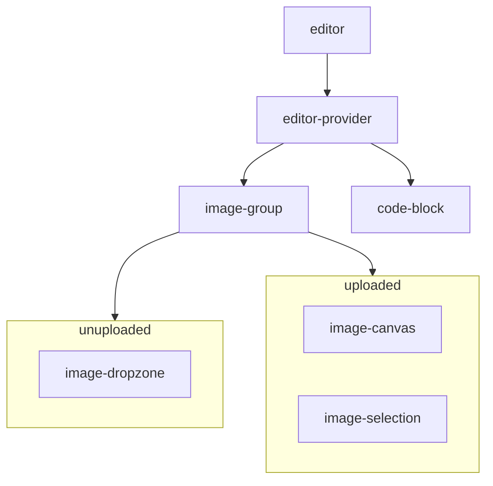

## 🔗 Related issue link

<!--

1. Describe the source of requirement. It's recommended to list the issue link.
2. Leave blank if there is no issue link.
-->

## 💡 Background and solution

I am using the group by feature approach for folder structure which helps me find related files easily.

Below is the component hierarchy overview.

### Why use the context provider pattern

- It's not a complex state, Most of the re-render is necessary when the state change.
- Friendly for component composition. Keep the exposed context API consistency to help alternate the sub-component or better implementation easily.

If resize or reposition the selection block needs to renew the preview data immediately, Maybe can split the context or use the state management library for the performance issue.

### Canvas

- Most of the canvas view updates do not rely on react manipulate, so I use `useRef` to keep the canvas internal state, e.g. mouse current status.
- Saving the latest canvas DOMRect via mousedown and use in mousemove, avoid get box metrics frequently (might cause unnecessary reflow).

### Libaraies

- react-dropzone: For file upload, prop getters API looks good to me.
- react-rnd: It's a higher-level wrapper of react-draggable and re-resizable combination, I think the API interface is easy to use.
- react-icons: Styling.
- styled-components: Styling.
- polished: CSS-in-JS toolset. use for setup the normalize CSS.
- nanoid: Unique string id for selection block.

## 🤔 TODO

- Naming is hard. If there are better ones please let me know.
- Not familiar with typescript, would you provide the suggestion for code smells?
- Maybe some grammar mistakes in this pull request description, hope it doesn't affect your reading.

## ☑️ Self Check before Merge

- [ ] Doc and Wiki are updated/provided or not needed.
- [ ] Followed the Commit Message Guidelines listed in CONTRIBUTING.md
